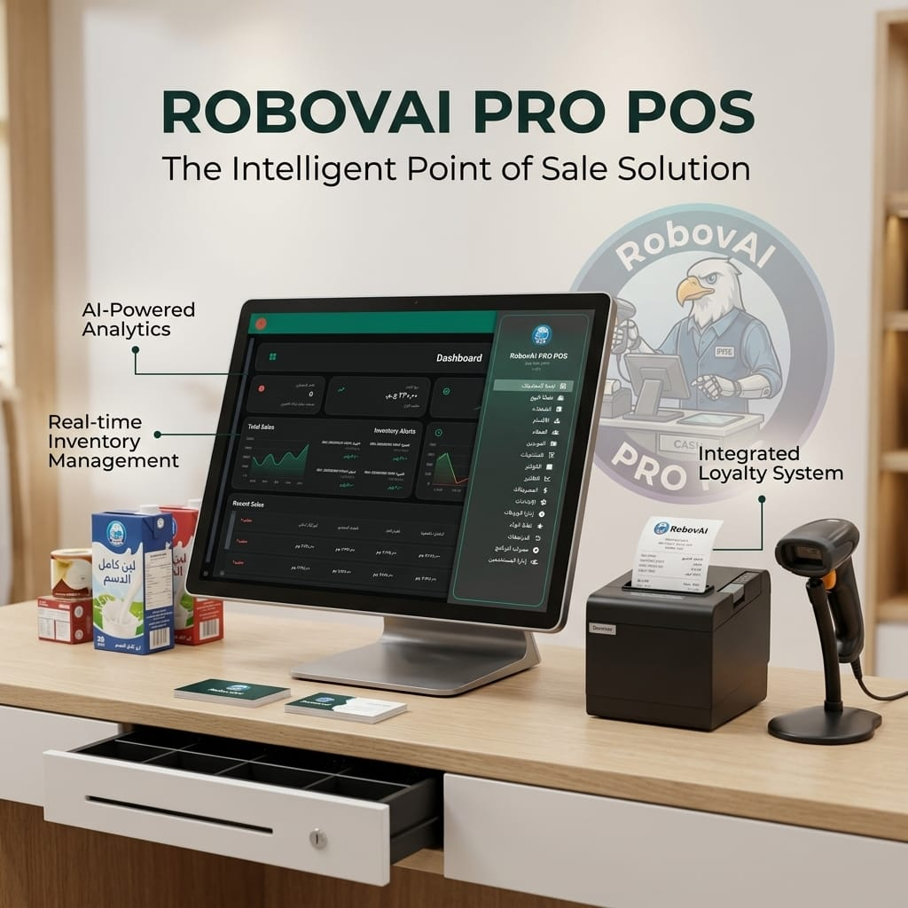
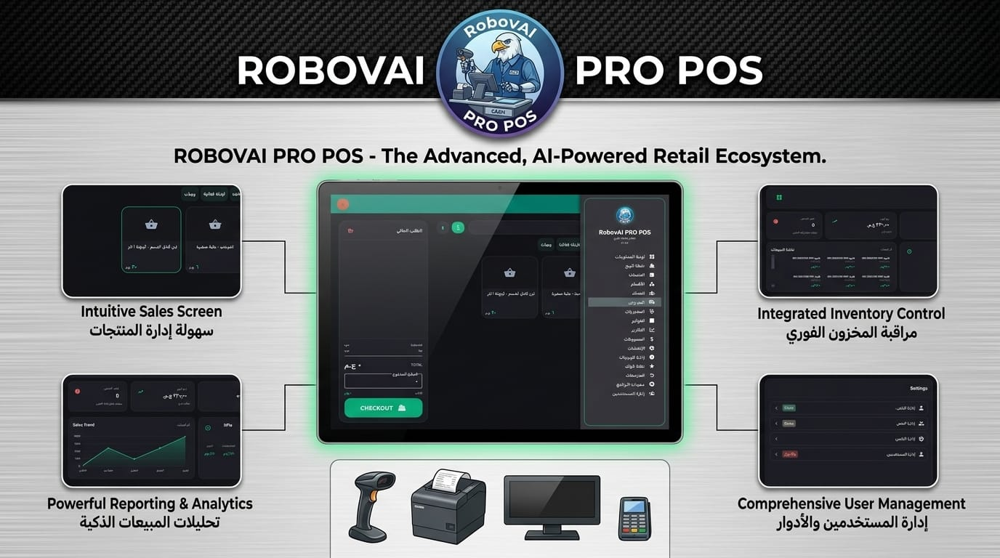

# RobovAI PRO POS v5.0
### The Intelligent Point of Sale Solution — نظام نقاط البيع الاحترافي





> **Developed by RobovAI Solutions** — AI-Powered · Real-time Inventory · Integrated Loyalty · Thermal Printing

## 🎨 UI (Al-Atmani 2026)

The current UI ships with the **Al-Atmani 2026** design system:

- Dark mode first
- Acrylic/glass surfaces (sidebar + cards)
- Bento-style dashboard layout
- Touch-first cashier (large hit targets + clear checkout CTA)

A comprehensive Point of Sale and Mini-ERP system built with **.NET 8 WPF** following Clean Architecture principles.

> Note: Older “Space Edition / SpaceTheme” documentation exists as legacy reference.

> Theme note (Feb 2026): `Themes/SpaceTheme.xaml` is **not loaded by default** to prevent legacy visual bleed. Enable only if needed via `src/SmartPOS.WPF/appsettings.json` → `Ui:EnableLegacySpaceTheme: true`.

## 🏗️ Architecture

The solution follows **Clean Architecture** with clear separation of concerns:

```
SmartPOS/
├── src/
│   ├── SmartPOS.Core/              # Domain Layer (Entities, Interfaces)
│   ├── SmartPOS.Infrastructure/     # Data Access & External Services
│   ├── SmartPOS.Application/        # Business Logic (ViewModels, Services)
│   └── SmartPOS.WPF/               # Presentation Layer (Views, UI)
```

## 🚀 Tech Stack

- **Framework**: .NET 8
- **UI Framework**: WPF with MVVM pattern
- **UI Library**: MaterialDesignInXamlToolkit
- **Database**: SQLite / SQL Server (Entity Framework Core)
- **Architecture**: Clean Architecture with Dependency Injection
- **Hardware**: ESC/POS Thermal Printers, Barcode Scanners

## 📦 Core Features

### 1. Smart Cashier Module (POS)

- Fast touch-optimized checkout interface
- Barcode scanner support (HID mode)
- Cart management (Hold/Resume/Split Payment)
- Discount logic and promotions
- Thermal receipt printing (ESC/POS)
- Cash drawer integration
- Multiple payment methods (Cash/Card/Mobile)

### 2. Mini-ERP (Inventory & Finance)

- Product management with categories
- Real-time stock tracking and alerts
- Multiple unit types (Piece/Box/Carton)
- Expense tracking
- Profit/Loss analysis
- Supplier debt management
- Purchase Orders (suppliers, line items)

### 3. Reporting & Analytics

- Real-time sales dashboard
- Visual charts (daily/weekly/monthly)
- Z-Report (End of Day) printing support

### 4. Advanced Modules

- Shift Management (open/close shifts, tracking)
- Loyalty Points (customer tiers and transactions)
- Returns (full/partial returns, stock adjustments)

These modules are now part of the main app experience (theme/UI may differ from older Space Edition screenshots).

## 🧭 Sections (UI Pages)

The current WPF UI includes these sections:

- Dashboard
- POS Cashier
- Products
- Categories
- Tables
- Customers
- Suppliers
- Purchase Orders
- Invoices
- Reports
- Expenses
- Settings
- Shift Management
- Loyalty
- Returns
- Features (in-app feature overview)

## 🛠️ Getting Started

### Prerequisites

- Visual Studio 2022 or later
- .NET 8 SDK
- SQL Server (optional, for production)

### Installation

1. Clone the repository
2. Restore NuGet packages
3. Build the solution
4. Run the application

```bash
dotnet restore
dotnet build SmartPOS.sln
dotnet run --project src/SmartPOS.WPF/SmartPOS.WPF.csproj
```

### Database Setup

```bash
# Navigate to Infrastructure project
cd src/SmartPOS.Infrastructure

# Create migration
dotnet ef migrations add InitialCreate

# Update database
dotnet ef database update
```

The default SQLite database file is created as `smartpos.db` (relative to the app working directory).

### Notes (SQLite + Printing)

- **SQLite aggregation**: SQLite can be sensitive with `SUM()` over `decimal` projections. The app uses safe aggregation (sum as `double?` then cast back to `decimal`) in reports/shift/dashboard paths.
- **Printing**: Printer selection avoids virtual printers (e.g., OneNote/PDF/XPS) by preferring the saved printer, then OS default, then first non-virtual device.

### Default Credentials

- **Admin**: `admin` / `admin123`
- **Cashier**: `cashier` / `cashier123`

If you have an old database with different credentials, delete `smartpos.db` and run the app again to reseed.

## 📝 License

© 2026 RobovAI Solutions Inc. All rights reserved.

This software is proprietary and confidential.

## 📞 Support & Contact

- **Website**: https://robovai.tech
- **Email**: contact.robovai@gmail.com
- **WhatsApp**: +20 112 189 1913
- **Office**: 6th of October, Egypt

## 👨‍💻 Author

RobovAI Solutions Inc. — *AI-Powered Retail Technology*
