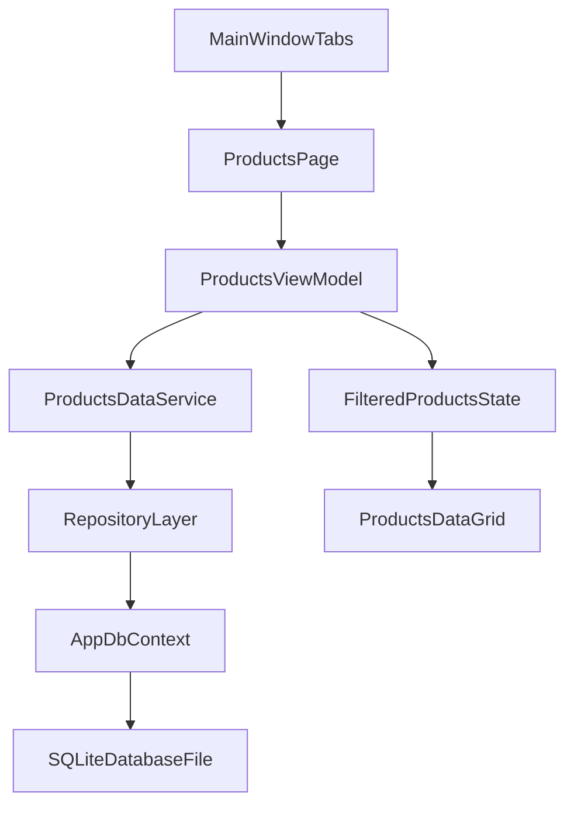

# خطة إصلاح برنامج الكاشير حتى v1.10

## الهدف
إصلاح مشكلة عدم ظهور المنتجات أولًا، ثم معالجة أخطاء ربط قاعدة البيانات عبر كل التبويبات، ثم تجهيز نسخة `v1.10` مستقرة ومثبتة عبر Inno Setup بدون أخطاء تشغيل معروفة.

## ما تم اكتشافه قبل التنفيذ
- شاشة المنتجات تعتمد على `FilteredProducts` في [f:/Raw/kasher/kasher/src/SmartPOS.WPF/Views/ProductsPage.xaml](f:/Raw/kasher/kasher/src/SmartPOS.WPF/Views/ProductsPage.xaml).
- تحميل المنتجات يتم من `LoadProductsAsync()` في [f:/Raw/kasher/kasher/src/SmartPOS.Application/ViewModels/ProductsViewModel.cs](f:/Raw/kasher/kasher/src/SmartPOS.Application/ViewModels/ProductsViewModel.cs) عبر `IRepository<Product>`.
- الاستعلام الحالي يستثني المحذوف منطقيًا (`IsDeleted`) في [f:/Raw/kasher/kasher/src/SmartPOS.Infrastructure/Repositories/Repository.cs](f:/Raw/kasher/kasher/src/SmartPOS.Infrastructure/Repositories/Repository.cs)، لذلك قد تكون البيانات موجودة لكنها مخفية.
- التطبيق يعمل فعليًا على SQLite عبر [f:/Raw/kasher/kasher/src/SmartPOS.WPF/App.xaml.cs](f:/Raw/kasher/kasher/src/SmartPOS.WPF/App.xaml.cs)، ومسار قاعدة البيانات يُحسم في [f:/Raw/kasher/kasher/src/SmartPOS.Infrastructure/Data/DatabasePathHelper.cs](f:/Raw/kasher/kasher/src/SmartPOS.Infrastructure/Data/DatabasePathHelper.cs)؛ هذا يجعل احتمالية قراءة ملف DB مختلف سببًا قويًا.
- توجد لااتساقية بين تبويبات تستخدم Repository وأخرى تستخدم `AppDbContext` مباشرة، ما ينتج سلوك بيانات مختلفًا بين الشاشات.

## مراحل التنفيذ

### المرحلة 1: إصلاح فوري لمشكلة المنتجات
- إضافة تشخيص واضح داخل مسار تحميل المنتجات لتمييز الحالات: (لا بيانات فعلية / كلها soft-deleted / فلتر واجهة مخفي النتائج / DB path مختلف).
- تثبيت منطق التحميل والفلترة في `ProductsViewModel` بحيث لا تظهر القائمة فارغة بسبب حالة واجهة غير مقصودة.
- إظهار رسالة/حالة UI واضحة في شاشة المنتجات بدل الصمت عند عدم وجود نتائج.
- التحقق من مسار DB الفعلي المستخدم وقت التشغيل وتأكيد أنه نفس القاعدة المتوقعة.

### المرحلة 2: توحيد ربط قاعدة البيانات في كل التبويبات
- توحيد نمط الوصول للبيانات تدريجيًا (Service/Repository موحّد) للتبويبات التي تستخدم `DbContext` مباشرة.
- مراجعة Lifetime الخاص بـ `DbContext` في DI داخل `App.xaml.cs` وتعديله لأسلوب أكثر ثباتًا مع WPF Host.
- توحيد قواعد soft-delete/query filtering حتى لا تختلف النتائج بين تبويب وآخر.
- تحسين handling لفشل `MigrateAsync` عند بدء التشغيل (رسالة مفهومة + مسار تعافي واضح بدل الإغلاق الصامت).

### المرحلة 3: تثبيت الجودة والاختبار الشامل
- بناء checklist تحقق وظيفي لكل التبويبات الأساسية: المنتجات، البيع، العملاء، الموردين، الفواتير، المخزون، الورديات، التقارير.
- إضافة اختبارات تكامل مركزة على البيانات (CRUD + فلاتر + ترابط الجداول + migration startup).
- تنفيذ smoke test شامل على قاعدة نظيفة وقاعدة موجودة مسبقًا (upgrade path).

### المرحلة 4: إصدار v1.10 عبر Inno Setup
- مراجعة/تحديث سكربت Inno Setup الحالي وتضمين كل المتطلبات التشغيلية.
- التأكد من مسارات البيانات بعد التثبيت (first run + update run) وعدم فقد البيانات.
- إخراج build نهائي `v1.10` مع خطوات تحقق release واضحة قبل التسليم.

## تصور تدفق البيانات بعد الإصلاح

## معايير القبول
- المنتجات تظهر بشكل صحيح دائمًا عند وجود بيانات غير محذوفة منطقيًا.
- أي مشكلة DB path أو migration تظهر برسالة واضحة يمكن التصرف بناءً عليها.
- لا يوجد اختلاف نتائج غير مبرر بين التبويبات بسبب اختلاف نمط الوصول للبيانات.
- نسخة `v1.10` تُثبت وتعمل على بيئة عميل جديدة وبيئة محدثة بدون أخطاء حرجة.